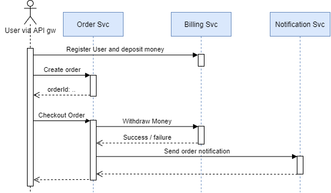
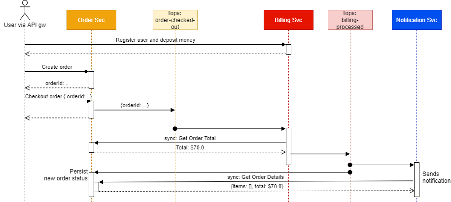
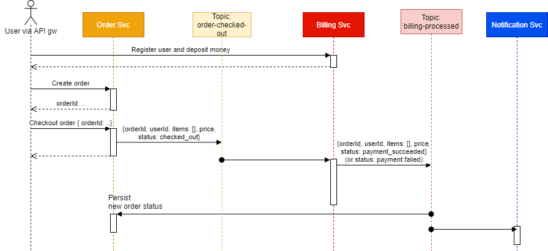

# Eventing


## Sync API

On order checkout, Order Service invokes withdrawal in Billing Service, and upon completion, invokes Notification Service - all synchronously.

* Order Service API: [spec](README.assets/sync-api/order.oas3.yaml), [SwaggerHub](https://app.swaggerhub.com/apis/audintsev/orders-service_sync_api/0.1.0)
* Billing Service API: [spec](README.assets/sync-api/billing.oas3.yaml), [SwaggerHub](https://app.swaggerhub.com/apis/audintsev/billing-service_sync_api/0.1.0)
* Notification Service API: [spec](README.assets/sync-api/notification.oas3.yaml), [SwaggerHub](https://app.swaggerhub.com/apis/audintsev/notification-service_sync_api/0.1.0)



## Notification-Assisted

On order checkout, Order Service publishes a *notification* to the `order-checked-out` topic. The message only contains ID of the order.

Billing Service listens the `order-checked-out` topic, extracts ID from the message, and triggers Order Service to get the details about the order (it's price).
Then Billing Service attempts to withdraw order price from user's account, and publishes a notification to the `billing-processed` topic.
This notification contains orderId and billing status: success or failure.

Both Order Service and Notification Service listen the `billing-processed` topic.
Billing Service updates order status in the DB.
Notification Service extracts orderId and billing status from the message, contacts Order Service to get info about the order (price, user, etc),
and then notifies the user by _sending an email_.



## Event Collaboration

On order checkout, Order Service publishes a *complete order object* to the `order-checked-out` topic.

Billing Service listens the `order-checked-out` topic, extracts all necessary information about the order from the message, including its price.
Then Billing Service attempts to withdraw order price from user's account, and publishes *complete updated order object* to the `billing-processed` topic.

Both Order Service and Notification Service listen the `billing-processed` topic.
Billing Service updates order status in the DB.
Notification Service extracts order details and billing status from the message, and then notifies the user by _sending an email_.




# Building and pushing

```
cd order
../gradlew bootBuildImage --imageName=udintsev/hw15-order:latest
docker push udintsev/hw15-order:latest

cd ../billing
../gradlew bootBuildImage --imageName=udintsev/hw15-billing:latest
docker push udintsev/hw15-billing:latest

cd ../notification
../gradlew bootBuildImage --imageName=udintsev/hw15-notification:latest
docker push udintsev/hw15-notification:latest

```

# REST API

```shell
# Create account in billing and deposit money
curl -H "Content-Type: application/json" -H "X-User-Id: john.doe@example.com" localhost:8081/api/v1/billing/deposit -X POST -v -d '{"amount": 100}'

# Create order
curl -H "Content-Type: application/json" -H "X-User-Id: john.doe@example.com" localhost:8080/api/v1/orders -d '{"items": [{"itemId": 10, "quantity": 1}, {"itemId": 22, "quantity": 3}]}'

# Checkout order
curl -H "Content-Type: application/json" localhost:8080/api/v1/orders/1/checkout -X POST

# List notifications
curl localhost:8082/api/v1/notification
```

Same with host arch.labs:
```shell
curl -H "Content-Type: application/json" -H "X-User-Id: john.doe@example.com" arch.labs/otusapp/audintsev/billing/api/v1/billing/deposit -X POST -v -d '{"amount": 100}'

curl -H "Content-Type: application/json" -H "X-User-Id: john.doe@example.com" arch.labs/otusapp/audintsev/order/api/v1/orders -d '{"items": [{"itemId": 10, "quantity": 1}, {"itemId": 22, "quantity": 3}]}'
curl arch.labs/otusapp/audintsev/order/api/v1/orders

curl -H "Content-Type: application/json" arch.labs/otusapp/audintsev/order/api/v1/orders/1/checkout -X POST

curl arch.labs/otusapp/audintsev/notification/api/v1/notification
```

Running postman collection against my dev env:

```shell
newman run --env-var "baseUrl=http://arch.labs" postman_collection.json
```

# Putting OpenAPI specs to use

## Mock server and validating proxy

Using [Prism](https://meta.stoplight.io/docs/prism/docs/getting-started/01-installation.md), we can
mock a server or run it as a proxy in front of a real server to validate
requests and responses going through, making sure our OpenAPI spec is up to date.

### TL;DR

```shell
# Install
npm install -g @stoplight/prism-cli

# Mocking based on examples
prism mock order-openapi.yaml

# Dynamic mocking based on schema
prism mock -d order-openapi.yaml

# Proxying
prism proxy order-openapi.yaml http://localhost:8080
```

## Contract Testing

[dredd](https://dredd.org/en/latest/index.html)

```shell
npm install -g dredd
```
